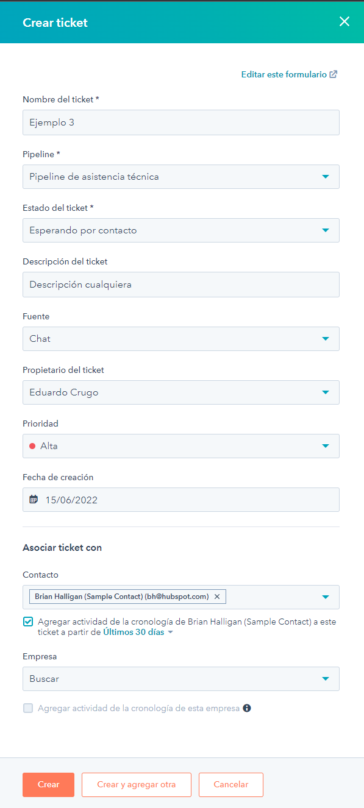

# Guía básica de la versión gratuita de HubSpot

## Hubspot tickets

Dentro del apartado de Asistencia técnica tendremos acceso a los Tickets

Los tickets son el método que vas a tener de recibir información sobre problemas que se encuentren e información importante de estos problemas

Para crear un ticket tenemos que pulsar el botón naranja de &quot;crear un ticket&quot; en la esquina superior derecha

Ejemplo de creación de ticket:

## Dentro de los tickets

Los tickets tienen diferentes campos que se rellenaran para dar información sobre el problema y quien lo envía. La información que va es estos tickets puede ser modificada mediante la opción de &quot;Editar este formulario&quot;

Al entrar en el editor accederemos a la posibilidad de añadir nueva información al ticket

## &quot;Pipeline&quot;

Dentro de las &quot;pipelines&quot; podemos agregar estados y automatizar diferentes procedimientos, pero debido a que estamos usando la versión gratuita tenemos acceso restringido a la posibilidad de automatización y creación de nuevas Pipelines

## Bandeja de entrada

En el apartado de &quot;Conversaciones&quot; encontraremos la bandeja de entrada.

Dentro de aquí podemos ver todas las conversaciones que tenemos en ese momento activas, tanto las que tenemos asignadas a nosotros como las que están por asignar.

Para crear una nueva conversación simplemente pulsamos el botón de &quot;Redactar&quot;localizado abajo a la derecha.

## Chatflows

En la misma bandeja de &quot;Conversaciones&quot; encontramos los Chatflows

Dentro de este apartado podemos crear un chatflow en el siguiente botón.

Cuando estamos creando un chatflow podemos elegir y asignar las personas a las que este va dirigido.

También podemos configurar la disponibilidad de este chat para que sea a una hora determinada o cuando los miembros de este estén disponibles.

Y así es como se vería

